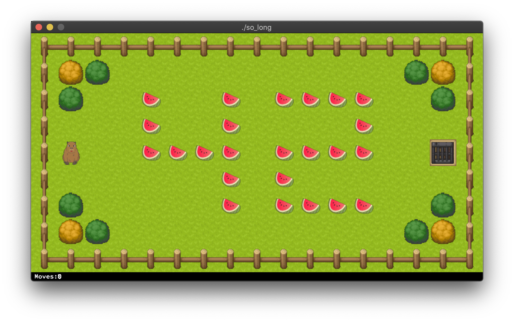

# 42 So Long
   [](https://github.com/ricardoreves/42-so-long/actions/workflows/norminette.yml) 

## 🪧 Overview
### Description
This project is a very small 2D game with [minilibx](https://harm-smits.github.io/42docs/libs/minilibx). Its purpose is to make you work with textures, sprites, and some other very basic gameplay elements.

### Goal
It’s time for you to create a basic computer graphics project. So long will help you improve your skills in the following areas: window management, event handling, colors, textures, and so forth. You are going to use the school graphical library: the MiniLibX! This library was developed internally and includes basic necessary tools to open a window, create images and deal with keyboard and mouse events.

## 📷 Preview

>The capybara (Hydrochaeris hydrochaeris), also called capybara, is a small herbivorous mammal belonging to the order of rodents and the family of cavidae. It measures more than a meter long and weighs more than 50 kg. Males weigh between 10 and 15 kg less than females.

## 🚀 Getting Started

### Prerequisites

MiniLibX for Linux requires xorg, x11 and zlib, therefore you will need to install the following dependencies: xorg, libxext-dev and zlib1g-dev. Installing these dependencies on Ubuntu can be done as follows:
```
sudo apt-get update && sudo apt-get install xorg libxext-dev zlib1g-dev libbsd-dev
```

### Installation
1. Clone the project.
```
git clone git@github.com:ricardoreves/42-so-long.git
```
2. Navigate to the project directory.
```
cd 42-so-long
```
3. Compile the game. (You can ignore the Minilibx compilation warning)
```
make
```

## 🕹 Usage
1. Start the game with a [map](maps/).
```
./so_long maps/42.ber
```
2. Move the player and collect objects, then go to the exit.
 
| Key | Action     |
| --- | ---------- |
| W   | Move Up    |
| A   | Move Left  |
| S   | Move Down  |
| D   | Move Right |
| R   | Reset Game |
| ESC | Quit Game  |

## 📚 References
- [github.com](https://harm-smits.github.io/42docs/libs/minilibx) - Minilibx documentation
- [github.com](https://github.com/S-LucasSerrano/miniLibX_sample) - Sample Minilibx project
- [github.com](https://gontjarow.github.io/MiniLibX/) - Introduction to Minilibx
- [github.com](https://github.com/keuhdall/images_example) - Implementation of images with Minilibx
- [github.io](https://qst0.github.io/ft_libgfx/man_mlx_new_image.html
) - MiniLibX manipulating images
- [itch.io](https://itch.io/game-assets) - Platform that host game assets. 

## 🧰 Tools
- [XPMConverter](https://anyconv.com/xpm-converter/) - Online tool to convert images PNG to XPM
- [SpriteCutter](https://ezgif.com/sprite-cutter/) - Online tool to cut sprite images
- [ImageMagick](https://imagemagick.org/) - Command-line tool to convert, edit, or compose digital images

## 📝 License
Distributed under the MIT License. See [LICENSE](LICENSE) for more information.


